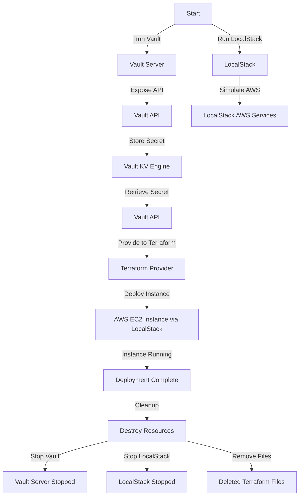

## Lancer Vault et LocalStack en local

Exécuter Vault avec Docker :

```powershell
docker run --cap-add=IPC_LOCK -d --name vault -p 8200:8200 hashicorp/vault
```

Exécuter LocalStack avec Docker :

```powershell
docker run --rm -d --name localstack -p 4566:4566 -e SERVICES=ec2 localstack/localstack
```

Exporter l'URL de Vault :

```powershell
$env:VAULT_ADDR="http://127.0.0.1:8200"
```

Activer Vault en mode développement :

```powershell
vault server -dev
$env:VAULT_TOKEN="root"
```

## Stocker un secret dans Vault

Activer le moteur de secrets KV :

```powershell
vault secrets enable -path=secret kv
```

Ajouter un secret :

```powershell
vault kv put secret/my-secret username=admin password=SuperSecure123
```

Vérifier le stockage du secret :

```powershell
vault kv get secret/my-secret
```

## Utiliser Terraform pour récupérer et utiliser les secrets de Vault avec LocalStack

Créer un dossier de projet :

```powershell
mkdir terraform-vault; cd terraform-vault
```

Créer un fichier `main.tf` :

```hcl
provider "vault" {
  address = "http://127.0.0.1:8200"
}

provider "aws" {
  access_key = "test"
  secret_key = "test"
  region     = "us-east-1"
  endpoint   = "http://localhost:4566"
}

data "vault_kv_secret_v2" "example" {
  mount = "secret"
  name  = "my-secret"
}

resource "aws_instance" "example" {
  ami           = "ami-12345678"
  instance_type = "t3.micro"
  provider      = aws
  user_data     = <<-EOT
    #!/bin/bash
    echo "Username: ${data.vault_kv_secret_v2.example.data["username"]}" > /tmp/credentials.txt
    echo "Password: ${data.vault_kv_secret_v2.example.data["password"]}" >> /tmp/credentials.txt
  EOT
}

output "username" {
  value     = data.vault_kv_secret_v2.example.data["username"]
  sensitive = true
}
```

Initialiser et appliquer Terraform :

```powershell
terraform init
terraform apply -auto-approve
terraform output
```

## Nettoyage des ressources

Supprimer les conteneurs Docker :

```powershell
docker stop vault localstack; docker rm vault localstack
```

Supprimer les fichiers Terraform :

```powershell
Remove-Item -Recurse -Force .terraform terraform.tfstate* terraform.tfvars
```
